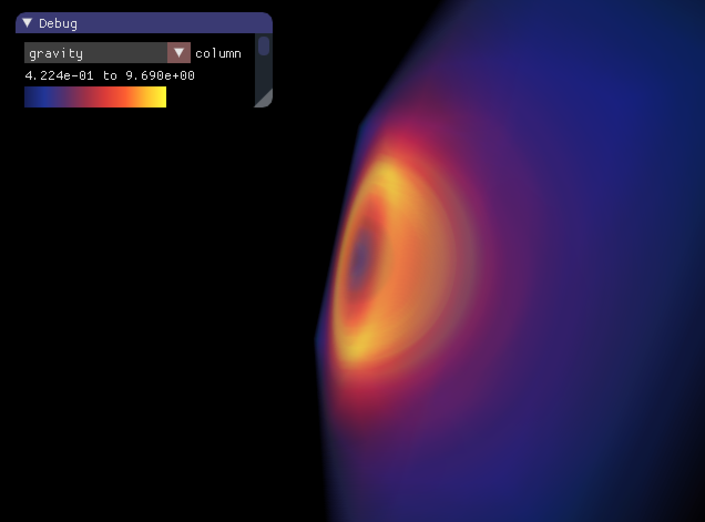
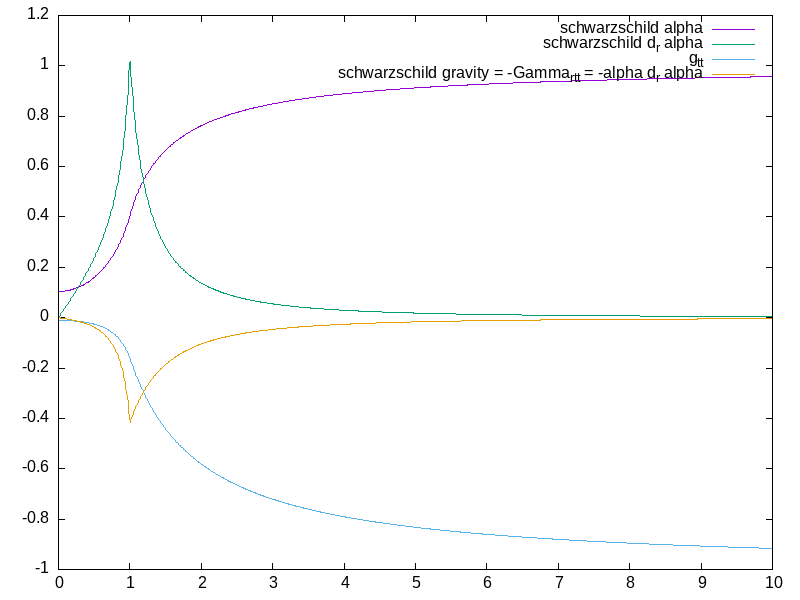
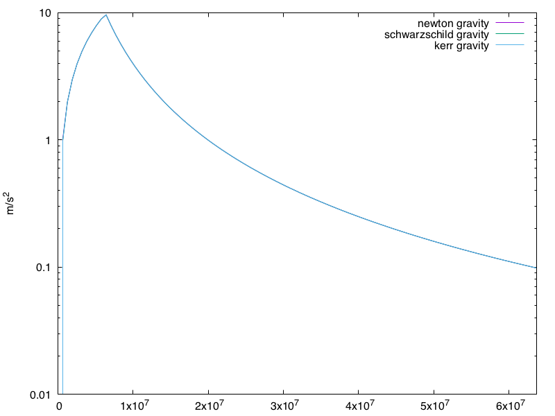
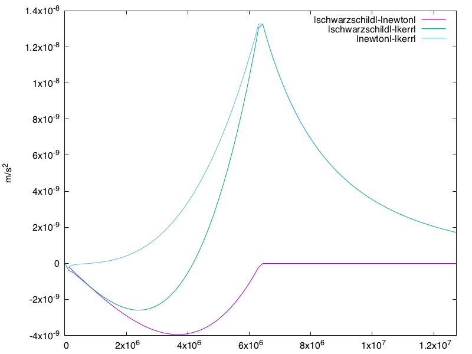
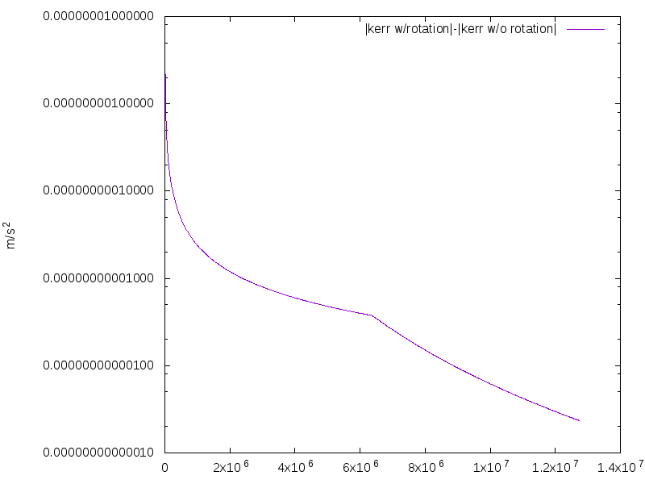
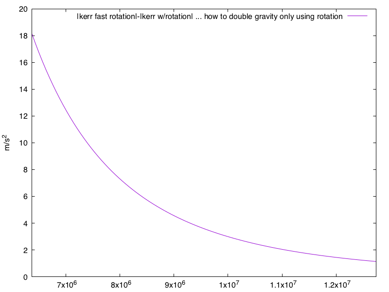

# Einstein Field Equation solution calculator.

Accepts stress-energy source terms of matter (density, specific internal energy, pressure) and electromagnetism (electric field, magnetic field).

Converges on solution via...
* 1. linear solver with solution vector corresponding to stress-energy source terms (which is constantly changing per-iteration, since the stress-energy tensor is based on the metric, which is being solved for)
* 2. JFNK solver whose zero is equal to the EFE: G_ab - 8 pi T_ab

goals:
* 1. (CHECK) verify Newtonian gravity matches Schwarzschild gravity from on to above the surface (I'm not doing this here, but I've done this in my solar system project)
* 2. (CHECK) verify Schwarzschild stellar model gravity due to analytical connection equations is maximal at surface, ->0 as r->0 and r->infinity
* 3. (CHECK) verify Schwarzschild stellar model gravity due to finite difference matches the analytical connection equation values
* 4. (CHECK) verify, with flat spacetime and stellar stress-energy, that the EFE constraint error is equal to the stellar body stress-energy within the body, and zero elsewhere.
* 5. (CHECK) verify, with Schwarzschild stellar model and stellar stress-energy, that the EFE constraint is near zero everywhere. ... well this works inside the planet and outside the planet, but on the changes in rho this has some numerical errors.
* add time 2nd derivatives to metric prims, from this compute time derivatives of connections, from that the Riemann, and then the Ricci and Einstein
* 6. get JFNK to work.
	My goal is to start at flat space, given Earth's stress-energy source term, and come up with Earth's gravity, as the Schwarzschild analytical answer already gives us.
	I am getting descent, however it is going really slow, so I'm going to port this project to OpenCL...

## Finite Difference Results:



Volumetric graph of the gravitational acceleration using finite differencing for the Schwarzschild-based TOV equation of structure for the Earth's parameters.

---

## Analytical Calculations:



Schwarzschild-based equations of structure with exhaggerated density.

---



Schwarzschild-based EOS gravity using Earth's parameters.
Taken from Misner, Thorne, and Wheeler's "Gravitation" box 23.2 on the TOV equations of structure starting from a Schwarzschild metric. 

---



Differences in between various gravity models, using Earth's parameters.
Note that the Kerr metric is approximated within the body as the Kerr metric, using for mass all matter contained within the radial coordinate.
This is not a correct equation of structure for the Kerr metric, as the correct Kerr EOS has not yet been solved for.

---



Difference between Kerr metric with and without rotation.
Note that Kerr without rotation exhibits less gravitational acceleration than Kerr with rotation, while Schwarzschild (which is rotation-less) exhibits more gravitational acceleration than Kerr. 

---



Kerr metric increase in acceleration due to faster rotation.


---

Some thoughts on results ...

Here are the variable ranges, initializing the stress-energy prims with the earth, initializing the metric prims with a flat metric:

```
after 0 iterations:
#	ix	iy	iz	rho	det-1	alpha-1	gravity	analyticalGravity	EFE_tt(g/cm^3)	EFE_ti	EFE_ij	G_ab
min	0	0	0	0	0	0	0	0.93126130172052	-5.5147098661213	0	0	0
max	15	15	15	4.0950296770075e-24	0	0	0	9.4304273489865	0	0	0	0

after 1 iterations of jfnk
#	ix	iy	iz	rho	det-1	alpha-1	gravity	analyticalGravity	EFE_tt(g/cm^3)	EFE_ti	EFE_ij	G_ab
min	0	0	0	0	-0.57528624373743	-0.2483215332056	-1.2855936147291	0.93126130172052	-2.9155846148211	5.6376265101891e-25	5.7454085369078e-27	6.8400743120253e-27
max	15	15	15	4.0950296770075e-24	-0.57528624373725	-0.24832153320289	1.3218539855677	9.4304273489865	1.220838980645	4.1759391983984e-21	3.1036763335186e-23	3.8474511176799e-23
```
