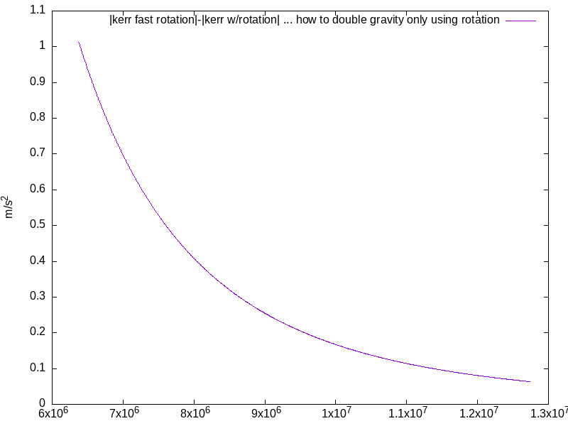

Einstein Field Equation solution calculator.

Accepts stress-energy source terms of matter (density, specific internal energy, pressure) and electromagnetism (electric field, magnetic field).
Converges on solution via...
(1) linear solver with solution vector corresponding to stress-energy source terms (which is constantly changing per-iteration, since the stress-energy tensor is based on the metric, which is being solved for)
(2) JFNK solver whose zero is equal to the EFE: G_ab - 8 pi T_ab

goals:
1) (CHECK) verify Newtonian gravity matches Schwarzschild gravity from on to above the surface (I'm not doing this here, but I've done this in my solar system project)
2) (CHECK) verify Schwarzschild stellar model gravity due to analytical connection equations is maximal at surface, ->0 as r->0 and r->infinity
3) (CHECK) verify Schwarzschild stellar model gravity due to finite difference matches the analytical connection equation values
4) (CHECK) verify, with flat spacetime and stellar stress-energy, that the EFE constraint error is equal to the stellar body stress-energy within the body, and zero elsewhere.
5) (CHECK) verify, with Schwarzschild stellar model and stellar stress-energy, that the EFE constraint is near zero everywhere. ... well this works inside the planet and outside the planet, but on the changes in rho this has some numerical errors.
-) add time 2nd derivatives to metric prims, from this compute time derivatives of connections, from that the Riemann, and then the Ricci and Einstein
6) get JFNK to work.
	My goal is to start at flat space, given Earth's stress-energy source term, and come up with Earth's gravity, as the Schwarzschild analytical answer already gives us.
	However starting in flat or Schwarzschild stellar, it takes one step then gets stuck in a (local, I hope) minima.
	Looking at distributions of numbers, the stellar and flat are both wrong: the stellar gets nonzero G_ab values in the vacuum (due to numeric errors of derivative approximations), and the flat gets nonzero G_ab values inside the body.

Finite Difference Results:

Schwarzschild-based equations of structure with exhaggerated density.

Schwarzschild-based EOS gravity using Earth's parameters.
Taken from Misner, Thorne, and Wheeler's "Gravitation" box 23.2 on the TOV equations of structure starting from a Schwarzschild metric. 

Differences in between various gravity models, using Earth's parameters.
Note that the Kerr metric is approximated within the body as the Kerr metric, using for mass all matter contained within the radial coordinate.
This is not a correct equation of structure for the Kerr metric, as the correct Kerr EOS has not yet been solved for.

Difference between Kerr metric with and without rotation.
Note that Kerr without rotation exhibits less gravitational force than Kerr with rotation, while Schwarzschild (which is rotation-less) exhibits more gravitational force than Kerr. 

Kerr metric increase in acceleration due to faster rotation.
